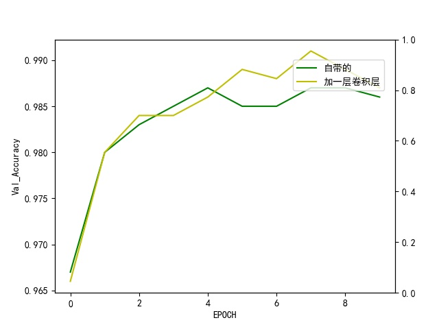
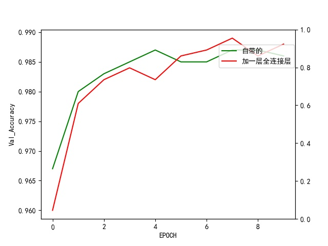
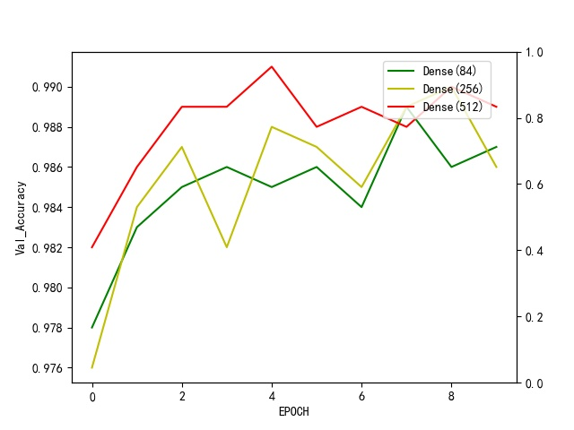
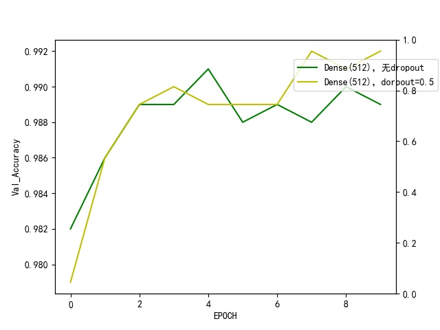
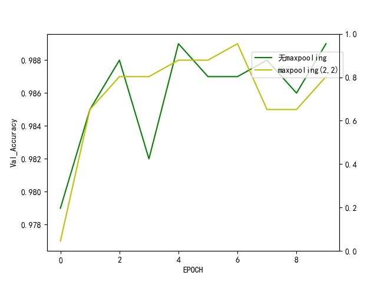

# Machine Learning and Transportation
## Introduction and Foundations
## Project: MNIST Handwritten Digits Recognition by LeNet 

M105120202 林湧  
M105120104  张蔚方  
2020/12/30

### Install

This project requires **Python**, **Tensorflow** and the following libraries installed:

- [NumPy](http://www.numpy.org/)
- [matplotlib](http://matplotlib.org/)
- [scikit-learn](http://scikit-learn.org/stable/)
- [keras](http://github//keras-team//keras)

## Introduction of the project
In current development, Convolutional Neural Networks has been applied to various fields. But researchers know little about CNN itself. For example, is the deeper CNN results in the higher accuracy? is Convolution layer better than Full connect layer that makes better accuracy? The purpose of this project is to explore how the architecture of CNN affect the Accuracy of recognition 
through tensorflow as well as keras. 

## Dataset
MNIST is an open source dataset which is used for handwritten digits recognition. It contains 55000 samples for training, 5000 samples for validation and 10000 samples for test. Each of sample is a 28x28 grayscale image and the content is 0 to 9 digit

# Tensorflow

## Test1
In test1, based on the original architecture, we add a convolution layer before FC layer. The shape of the weight variavle is 3x3x32, and due to the 5x5x16 Input image shape, we get 3x3x32 images after the new convolution layer.The validation accuracy after 10 epochs is shown as follows:

As we can see in the picture, if we add an convolution layer, the validation accuracy will improve a little bit.The test accuracy of new architecture is 0.986, which is also higher than the original CNN architecture, 0.982. ##这里可以写写原因##

## Test2
In test2, based on the original architecture, we add a FC layer before the last FC layer additionally. The input of the new FC layer is 84 and the output is 44.So we should finetune the input of the last layer to 44.

As shown in the picture, after 5 epochs, the validation accuracy of new CNN architecture becomes higher than the original one, though it is not so consipicously. The test accuracy of new architecture is 0.988, which is also higher than the original CNN architecture, 0.982.

# Keras

## Test1
In test1 of Keras, we test how the number of neurons in FC layer affect the accuracy.We finetune the first FC layer to see the different accuracy.(because the last FC layer's neurons can't be changed) We tested Dense(84), Dense(256), Dense(512), and the validation accuracy after 10 epochs is shown as follows:

From the picture, we can see that the Dense(512)'s validation accuracy is the best in this test, higher than the Dense(256), followed by the Dense(84). The test accuracy of the three experiments is 0.9900(Dense(84)); 0.9863(Dense(256)); 0.9894(Dense(512)).

## Test2
In test2, we test how the dropout layer influence the accuracy. We add a dropout layer after two convolution layer, and the dropout rate is set by 0.5.The original architecture and the new one's validation accuracy after 10 epochs are shown as follows:

The picture intuitively shows that if we add a dropout layer, the accuracy will increase a little bit.The test accuracy of CNN architecture with dropout layer is 0.9915, which is also higher than the original one, 0.9894.

 ## Test3
 In test3, we contrast the CNN architecture with max pooling to the CNN without max pooling, The max pooling's parameters are set by (2,2). And the validation accuracy after 10 epochs are as follows:

 

As shown in the pictue, surprisingly, we can see that after adding a max pooling layer, the validation accuracy is worse than the original architecture.

## Conclusions
After these tests, we can draw some conclusions:  
**--1--**  
The deeper CNN architecture, the more accurate result we can get. No matter we add a convolution layer or a FC layer, the accuracy will be a little bit higher. As far as i am concerned, deeper CNN has a better ability to classify the images.
  
**--2--**  
The dropout layer has a very strong ability to prevent overfitting and increse the test accuracy.The test accuracy in test2 of keras can be 0.9915, it's very high.

**--3--**  
The max pooling layer in test3 results in the worse accuracy, I guess the max pooling should be used in conjunction with convolutional layers to exert its strength.

## Summary           
This project is very meaningful. we need to restructure the LeNet to see how different architecture affect the validation accuracy and test accuracy. And after the project, we will have a very deep understanding of CNN, and then apply CNN to various fields. Thanks to professor and my classmates, without their help, I can't complete the project perfectly.